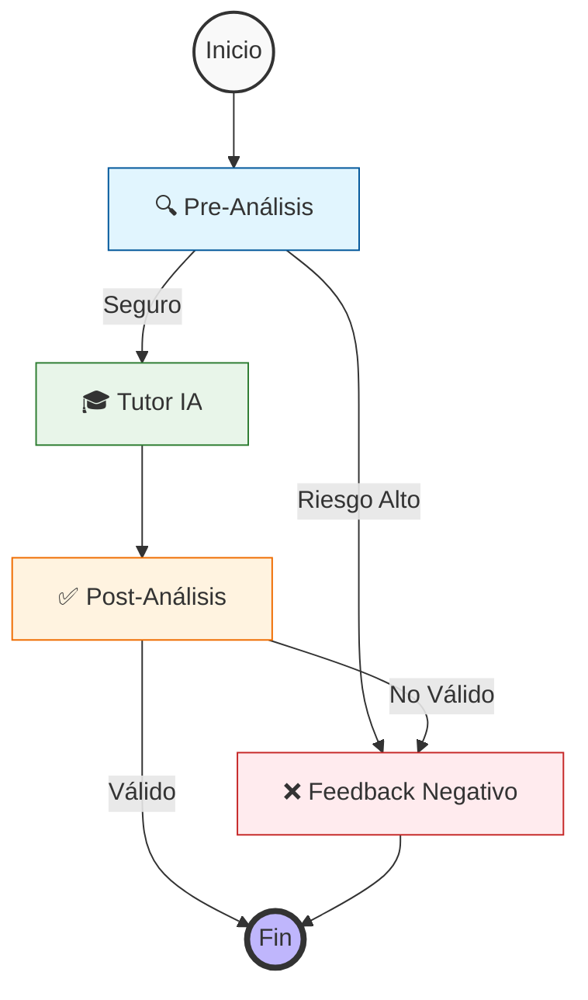

# 🎓 SOCRAT-AI

<div align="center">


**Un tutor académico con método socrático y arquitectura anti-trampa basada en graphs**

[Características](#-características-principales) • [Instalación](#-instalación) • [Uso](#-uso) • [Arquitectura](#-arquitectura) • [API](#-api-reference) • [Ejemplos de uso](#-Ejemplos) • [Material para pruebas](#-Pruebas)

</div>

---

## 📖 Descripción

SOCRAT-AI es un tutor académico inteligente diseñado para guiar a los estudiantes en su proceso de aprendizaje sin entregar respuestas directas. Utilizando el **método socrático**, fomenta el pensamiento crítico mediante preguntas estratégicas y validación continua contra rúbricas de evaluación.

### ✨ Características Principales

- 🧠 **Método Socrático**: Guía mediante preguntas en lugar de respuestas directas si es posible.
- 🛡️ **Sistema Anti-Trampa**: Arquitectura de nodo que detecta intentos de trampa.
- 📊 **Validación de Rúbricas**: Evalúa respuestas contra criterios académicos específicos.
- 📄 **Procesamiento de Documentos**: Soporte para entregables PDF y DOCX adjuntos.
- ⚡ **Baja Latencia**: Veloz y exacto, respuestas casi instantaneas sin streaming.
- 🔍 **Trazabilidad basica**: Logging de procesos para debugs y tests, etc

---

## 🏗️ Arquitectura

### Stack Tecnológico

| Componente | Tecnología | Razón de Elección |
|------------|-----------|-------------------|
| **Framework** | FastAPI | Facil de usar, manejo nativo de asincronía para lidiar con latencia |
| **LLM** | Gemini 3 Preview | Óptimo balance velocidad/rendimiento en razonamiento |
| **Orquestación** | LangGraph | Flujos de agentes cíclicos y validaciones granulares |
| **Validación** | Pydantic | Contratos de datos estrictos y salidas estructuradas |
| **Documentos** | Gemini Files API | Procesamiento eficiente y económico de archivos temporales |
| **Logging** | Loguru | Trazabilidad basica para hacer debugging en nodos.|

### Flujo de LangGraph



### 🛡️ Sistema de Guardrails Anti-Fraude

Como se enfatizo en que era muy importante asegurar la seguridad y cumplimiento etico, pero tambien mantener calidad en el tutor, tome esta decision para que el sistema fuera mas resiliente ante posibles vulnerabilidades, esto añadio algo de overhead pero lo vale, hace el sistema escalable a mi parecer.
Intente hacer que fuera muy modular para que sea facil de refactorizar.
En lugar de depender de un único prompt que puede ser vulnerable a *prompt injection* o bypass, el sistema utiliza **nodos especializados para mantener la calidad de la respuesta del agente y rechazar los intentos de hacer trampa**:

1. **Nodo Guardián (Pre-Análisis)**
   - Evalúa la intención del usuario
   - Detecta intentos de obtener respuestas directas o plagio
   - No deja pasar al nodo tutor si decide que hay riesgo

2. **Nodo Tutor**
   - Genera respuestas basado en la peticion del usuario despues de ser "sanitizada" en el nodo anterior
   - Aplica metodología socrática
   - Mantiene el balance entre ayuda y autonomía

3. **Nodo de Post-Análisis**
   - Revisor independiente de calidad
   - Verifica que no se haya filtrado la solución
   - Valida cumplimiento de estándares pedagógicos

---

## 🧠 Técnicas de Prompting

El sistema implementa las siguientes técnicas de ingeniería de prompts:

- **Grounding Anchors**: Citación textual de rúbricas para reducir alucinaciones
- **Chain of Thought (CoT)**: Razonamiento explícito antes de cada resultado, disminuye alucinaciones y mantiene coherencia
- **Decisiones Binarias**: Posturas claras (Sí/No) para evitar ambigüedades
- **Separación de Responsabilidades**: Un prompt = una tarea (validar, enseñar o revisar)

## Que mejoras haria?

Antes de pasar a la instalacion y el API, listare las mejoras que le haria al programa.
- **Implementacion de memoria basica**: Añadir al estado del graph la lista de mensajes previos o utilizar checkpointers de langgraph.
-**Multitenencia**: Un sistema basico de usuarios que permita a cada usuario tener su conversación.
-**Hashing para la subida de entregables**: Añadiria Redis y una funcion para hacer hashing de 256 bits a cada archivo subido como entregable y comprobar si se encuentra disponible en la FILES API, en caso de hacerlo ejecuta un query a redis para obtener el .name ligado a ese hash y hacer la consulta a la FILES API.
-**Front-end Ligero**: Un ligero front-end web o una TUI para utilizar el programa de forma local.
-**Mejor manejo de errores**: Añadiria mas codigos HTTP para trazar excepciones.
-**Mejoras en logs**: Implementaria un sistema de logs mas sofisticado para seguir mejor el state.
-**Refactorizacion o mejora de langgraph**: Evaluaria si la solucion actual esta overengineered o si le falta robustez y revisaria alternativas para tener mejor calidad en resultados.
-**Nuevos Prompts y refactor de modelos**: Con mas tiempo escribiria prompts mejor pensados y quiza añadiria evaluaciones numericas del 1 al 10 sobre la calidad de la respuesta producida para que un juez pueda retroalimentar al tutor en caso de que el input amerite una respuesta mejor formada. 


## 🚀 Instalación

### Requisitos Previos

- Python 3.10 o superior
- Cuenta de Google Cloud con API de Gemini habilitada

### Instalación Local

```bash
# 1. Clonar el repositorio
git clone https://github.com/raulgooo/socrat-ai.git
cd socrat-ai

# 2. Crear entorno virtual
python -m venv venv
source venv/bin/activate  # En Windows: cmd -> venv\Scripts\activate.bat powrshell -> venv\Scripts\activate.ps1

# 3. Instalar dependencias
pip install -r requirements.txt

# 4. Configurar variables de entorno
cp .env.example .env
# Editar .env y agregar tu GOOGLE_API_KEY
```

### Instalación con Docker

```bash
# Construir imagen
docker build -t socrat-ai .

# Ejecutar contenedor
docker run -p 8000:8000 --env-file .env socrat-ai
```

### Variables de Entorno

```env
GOOGLE_API_KEY=tu_api_key_aqui
```

---

## 💻 Uso

### Iniciar el Servidor

```bash
uvicorn main:app --reload
```

El servidor estará disponible en `http://localhost:8000`

### Documentación Interactiva

Accede a la documentación auto-generada de FastAPI:
- **Swagger UI**: http://localhost:8000/docs

---

## 📡 API Reference

### `POST /tutor/analyze`

Analiza una consulta del estudiante y genera retroalimentación socrática.

**Responses**:

| Código | Descripción |
|--------|-------------|
| `200` | Respuesta exitosa con guía del tutor |
| `400` | Datos de entrada inválidos |
| `429` | Límite de cuota de API alcanzado |
| `500` | Error interno del servidor |

**Request** (multipart/form-data):

```curl
curl -X 'POST' \
  'http://127.0.0.1:8000/tutor/analizar' \
  -H 'accept: application/json' \
  -H 'Content-Type: multipart/form-data' \
  -F 'enunciado=Resolver una serie de ejercicios sobre integrales definidas utilizando el Teorema Fundamental del Cálculo. Se debe mostrar el procedimiento completo y la interpretación geométrica del resultado (área bajo la curva)' \
  -F 'rubrica=Aplicación correcta de las fórmulas de integración (40%)\n- Evaluación precisa de los límites de integración (30%)\n- Explicación de la interpretación geométrica (30%)' \
  -F 'pregunta=Tengo dudas con el Teorema Fundamental del Cálculo. ¿Me podrías explicar los pasos lógicos que debo seguir para resolver una integral definida sin darme la respuesta de un ejercicio en particular?' \
  -F 'entregable=' \
  -F 'entregable_texto=Tengo la función f(x) = x^2 y quiero integrarla de 1 a 3, pero no sé qué hacer después de encontrar la antiderivada.'
```

**Ejemplo de Respuesta 200**:

```curl
{
  "chain_of_thought": "El estudiante ha logrado encontrar la antiderivada, que es el primer paso crucial en la resolución de integrales definidas. Su duda radica en cómo proceder con los límites de integración. Mi objetivo es explicarle de forma clara y paso a paso cómo aplicar el Teorema Fundamental del Cálculo para evaluar la integral definida una vez que se tiene la antiderivada, sin resolver su ejercicio específico. Debo enfatizar la evaluación de los límites y la interpretación geométrica, tal como lo solicita la rúbrica y el enunciado de la actividad.",
  "anchor_references": [
    "Evaluación precisa de los límites de integración (30%)",
    "Explicación de la interpretación geométrica (30%)",
    "Resolver una serie de ejercicios sobre integrales definidas utilizando el Teorema Fundamental del Cálculo. Se debe mostrar el procedimiento completo y la interpretación geométrica del resultado (área bajo la curva)"
  ],
  "output": "¡Excelente que ya tienes la antiderivada! Ese es un gran avance. Ahora, para resolver una integral definida utilizando el Teorema Fundamental del Cálculo, la clave está en cómo usas esa antiderivada y los límites de integración (en tu caso, 1 y 3).\n\nAquí te explico los pasos lógicos a seguir:\n\n1.  **Identifica la antiderivada (o primitiva):** Si tu función original es f(x), el primer paso es encontrar su antiderivada F(x). Parece que ya lo tienes dominado.\n\n2.  **Evalúa la antiderivada en el límite superior:** Una vez que tienes F(x), el siguiente paso es sustituir el límite superior de integración (el número de arriba en el símbolo de la integral, en tu caso 3) en tu antiderivada. Esto te dará un valor numérico, llamémoslo F(b) (donde 'b' es el límite superior).\n\n3.  **Evalúa la antiderivada en el límite inferior:** Después, harás lo mismo con el límite inferior de integración (el número de abajo en el símbolo de la integral, en tu caso 1). Sustituye este valor en tu antiderivada F(x) para obtener otro valor numérico, F(a) (donde 'a' es el límite inferior).\n\n4.  **Resta los resultados:** El valor de la integral definida se obtiene restando el resultado de la evaluación en el límite inferior del resultado de la evaluación en el límite superior. Es decir, la integral definida será igual a F(b) - F(a).\n\n    *   **Importante:** El orden de la resta es fundamental. Siempre es (evaluación en el límite superior) menos (evaluación en el límite inferior).\n\n5.  **Interpreta el resultado geométricamente:** El número que obtengas al final (F(b) - F(a)) tiene un significado geométrico muy importante. Representa el **área neta** entre la gráfica de tu función f(x) y el eje x, en el intervalo definido por tus límites de integración (de 'a' a 'b'). Si el resultado es positivo, el área está predominantemente por encima del eje x; si es negativo, está predominantemente por debajo. Si es cero, las áreas positivas y negativas se compensan.\n\nAsí que, en resumen, después de encontrar tu antiderivada F(x), solo necesitas calcular F(3) y F(1), y luego restar F(3) - F(1). ¡Verás que es un proceso muy directo!"
}
```

---


</div>
