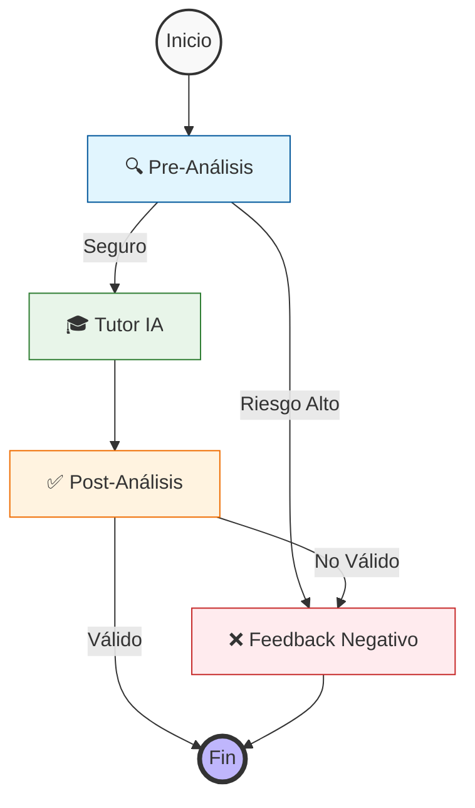

# 🎓 SOCRAT-AI

<div align="center">


**Un tutor académico con método socrático y arquitectura anti-fraude basada en agentes**

[Características](#-características-principales) • [Instalación](#-instalación) • [Uso](#-uso) • [Arquitectura](#-arquitectura) • [API](#-api-reference)

</div>

---

## 📖 Descripción

SOCRAT-AI es un tutor académico inteligente diseñado para guiar a los estudiantes en su proceso de aprendizaje sin entregar respuestas directas. Utilizando el **método socrático**, fomenta el pensamiento crítico mediante preguntas estratégicas y validación continua contra rúbricas de evaluación.

### ✨ Características Principales

- 🧠 **Método Socrático**: Guía mediante preguntas en lugar de respuestas directas
- 🛡️ **Sistema Anti-Fraude**: Arquitectura multi-agente que detecta intentos de trampa
- 📊 **Validación de Rúbricas**: Evalúa respuestas contra criterios académicos específicos
- 📄 **Procesamiento de Documentos**: Soporte para PDF y DOCX adjuntos
- ⚡ **Baja Latencia**: Optimizado para respuestas en tiempo real
- 🔍 **Trazabilidad Completa**: Logging detallado para debugging y auditoría

---

## 🏗️ Arquitectura

### Stack Tecnológico

| Componente | Tecnología | Razón de Elección |
|------------|-----------|-------------------|
| **Framework** | FastAPI | Manejo nativo de asincronía para mitigar latencia |
| **LLM** | Gemini 1.5 Flash | Óptimo balance velocidad/rendimiento en razonamiento |
| **Orquestación** | LangGraph | Flujos de agentes cíclicos y validaciones granulares |
| **Validación** | Pydantic | Contratos de datos estrictos y salidas estructuradas |
| **Documentos** | Gemini Files API | Procesamiento eficiente y económico de archivos |
| **Logging** | Loguru | Trazabilidad y debugging en desarrollo |

### Flujo de Agentes



### 🛡️ Sistema de Guardrails Anti-Fraude

En lugar de depender de un único prompt vulnerable a *prompt injection*, el sistema utiliza **nodos especializados**:

1. **Nodo Guardián (Pre-Análisis)**
   - Evalúa la intención del usuario
   - Detecta intentos de obtener respuestas directas o plagio
   - Detiene el flujo si identifica riesgo alto

2. **Nodo Tutor**
   - Genera guía pedagógica basada en la rúbrica
   - Aplica metodología socrática
   - Mantiene el balance entre ayuda y autonomía

3. **Nodo de Post-Análisis**
   - Revisor independiente de calidad
   - Verifica que no se haya filtrado la solución
   - Valida cumplimiento de estándares pedagógicos

---

## 🧠 Técnicas de Prompting

El sistema implementa técnicas de ingeniería de prompts de última generación:

- **Grounding Anchors**: Citación textual de rúbricas para reducir alucinaciones
- **Chain of Thought (CoT)**: Razonamiento explícito antes de cada resultado
- **Decisiones Binarias**: Posturas claras (Sí/No) para evitar ambigüedades
- **Separación de Responsabilidades**: Un prompt = una tarea (validar, enseñar o revisar)


## 🚀 Instalación

### Requisitos Previos

- Python 3.10 o superior
- Cuenta de Google Cloud con API de Gemini habilitada

### Instalación Local

```bash
# 1. Clonar el repositorio
git clone https://github.com/raulgooo/socrat-ai.git
cd socrat-ai

# 2. Crear entorno virtual
python -m venv venv
source venv/bin/activate  # En Windows: venv\Scripts\activate

# 3. Instalar dependencias
pip install -r requirements.txt

# 4. Configurar variables de entorno
cp .env.example .env
# Editar .env y agregar tu GOOGLE_API_KEY
```

### Instalación con Docker

```bash
# Construir imagen
docker build -t socrat-ai .

# Ejecutar contenedor
docker run -p 8000:8000 --env-file .env socrat-ai
```

### Variables de Entorno

```env
GOOGLE_API_KEY=tu_api_key_aqui
```

---

## 💻 Uso

### Iniciar el Servidor

```bash
uvicorn main:app --reload
```

El servidor estará disponible en `http://localhost:8000`

### Documentación Interactiva

Accede a la documentación auto-generada de FastAPI:
- **Swagger UI**: http://localhost:8000/docs
- **ReDoc**: http://localhost:8000/redoc

---

## 📡 API Reference

### `POST /tutor/analyze`

Analiza una consulta del estudiante y genera retroalimentación socrática.

**Request** (multipart/form-data):

```json
{
  "prompt": "¿Cómo resuelvo esta integral?",
  "rubric": "El estudiante debe aplicar sustitución trigonométrica...",
  "files": ["archivo.pdf"]  // Opcional
}
```

**Responses**:

| Código | Descripción |
|--------|-------------|
| `200` | Respuesta exitosa con guía del tutor |
| `400` | Datos de entrada inválidos |
| `429` | Límite de cuota de API alcanzado |
| `500` | Error interno del servidor |

**Ejemplo de Respuesta 200**:

```json
{
  "chain_of_thought": "El estudiante pide ayuda con una integral...",
  "anchor_references": [
    "Rúbrica: El estudiante debe identificar el tipo de integral..."
  ],
  "output": "¿Qué tipo de integral observas? ¿Reconoces algún patrón en la función?"
}
```

---


[Reportar Bug](https://github.com/tu-usuario/socrat-ai/issues) • [Solicitar Feature](https://github.com/tu-usuario/socrat-ai/issues)

</div>
