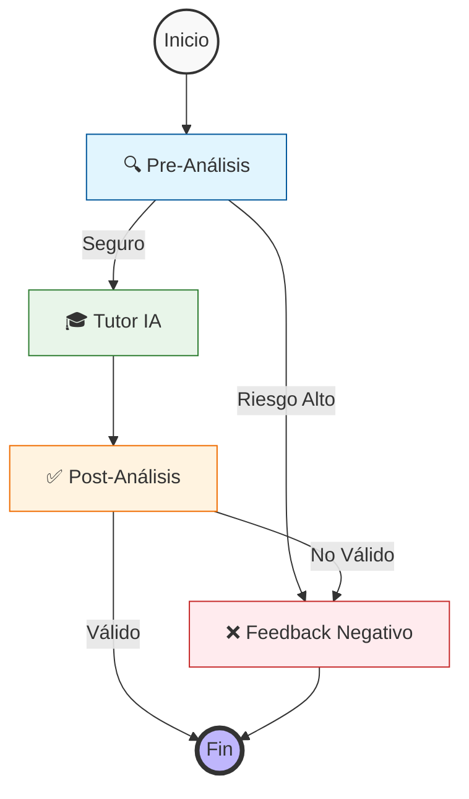

### Flujo de Agentes

```mermaid
graph TD
    Start((Inicio)) --> PreAnalysis[🔍 Pre-Análisis]
    
    PreAnalysis -- "Riesgo Alto" --> NegativeFeedback[❌ Feedback Negativo]
    PreAnalysis -- "Seguro" --> Tutor[🎓 Tutor IA]
    
    Tutor --> PostAnalysis[✅ Post-Análisis]
    
    PostAnalysis -- "Válido" --> End((Fin))
    PostAnalysis -- "No Válido" --> NegativeFeedback
    
    NegativeFeedback --> End

    style Start fill:#f9f9f9,stroke:#333,stroke-width:2px
    style End fill:#bfb6fc,stroke:#333,stroke-width:4px
    style PreAnalysis fill:#e1f5fe,stroke:#01579b
    style Tutor fill:#e8f5e9,stroke:#2e7d32
    style PostAnalysis fill:#fff3e0,stroke:#ef6c00
    style NegativeFeedback fill:#ffebee,stroke:#c62828
```